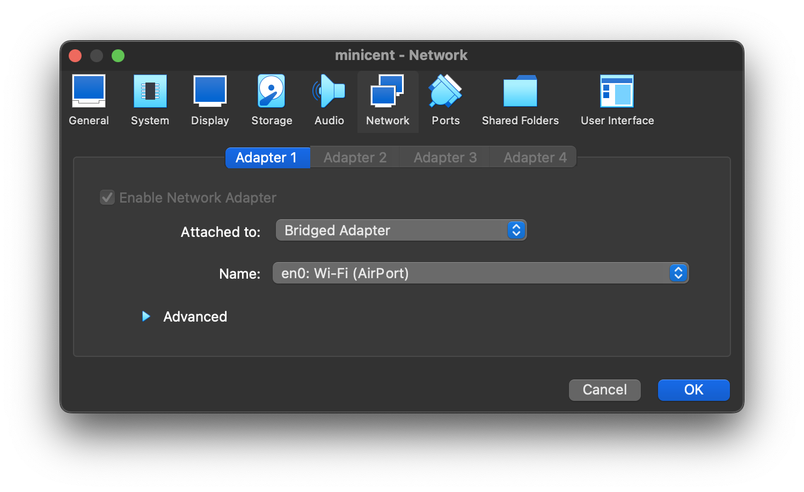

# Enable SSH Access into VirtualBox VM

Open your VM **Settings** -> **Network** tab -> Change Adapter into **Bridged
Adapter**.



Start the VirtualMachine, then run ssh command to connect using `VM`'s IP.

```bash
ssh user@vm-ip
```

## Recommended SSH client
- [Termius](https://termius.com/)
- [Putty](https://www.putty.org/)
